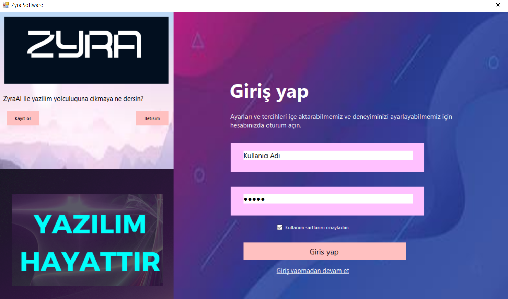
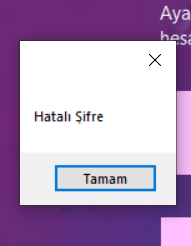
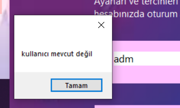
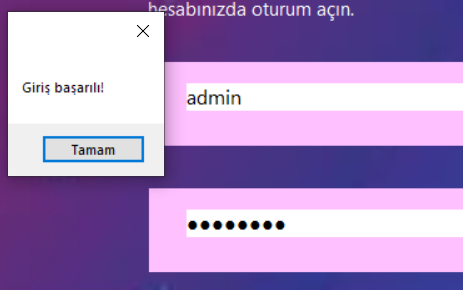

# Kullanım
Projeyi yükleyiniz. Yükledikten sonra vs2022de çalıştırınız.
Çalıştırdıktan sonra `MyForm.h` tıklayın ve tasarımınızı yapın.
Tasarımınızı değiştirdikten sonra eventleri güncelleyiniz.

# Şifre - Kullanıcı adı
kullanıcı adı: admin,
Şifre: password

# Özellikler
- Şifre - Kullanıcı adı kontrolü
- messageBox
- Onay

# Resimler

*GENEL GÖRÜNÜM*

*Bildirimler*

*Onay*

